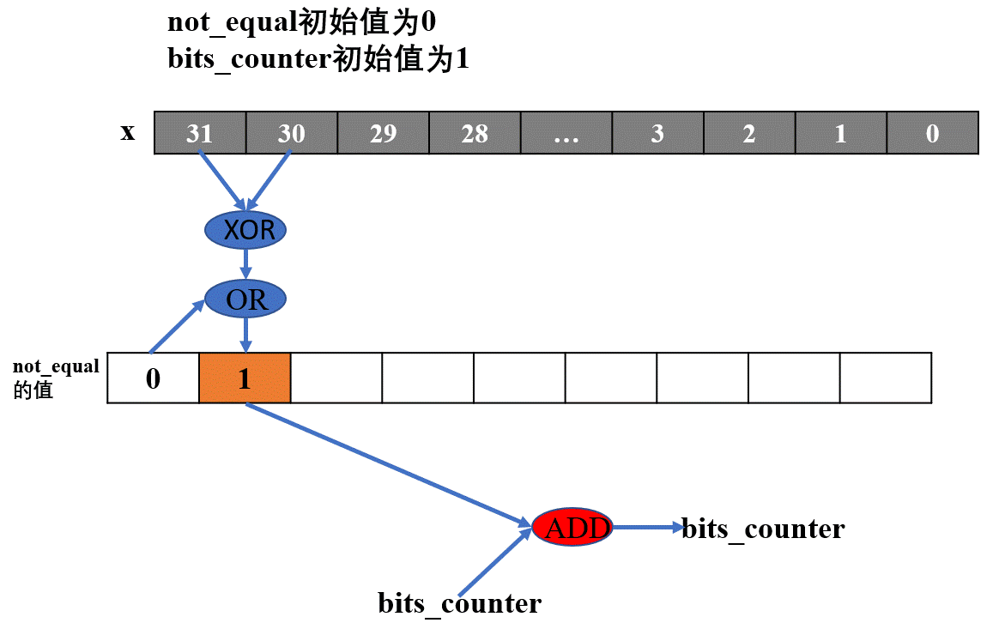
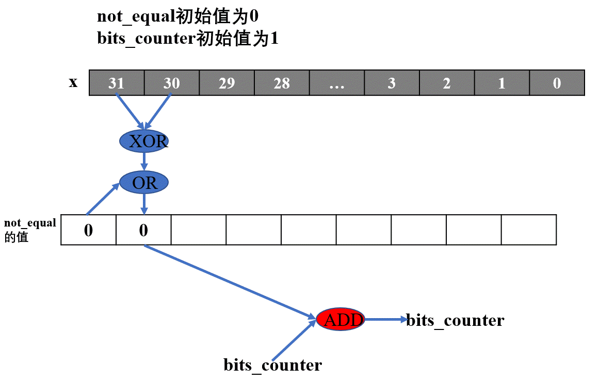

# datalab思路及方法
`datalab的实验分为两个部分：int和float。`

## int部分实验
实验对能使用的操作符和数据类型进行了限制，在int部分实验中使用的常数范围只能在`0x01~0xFF`，使用的数据类型只能是`int`，不能使用控制结构如`if, while, for，>, <`等

### `0x00` bitXor
- int bitXor(int x, int y)
- 使用`~`和`&`实现一个异或函数  
  
  因为x与y的异或等价于 $\overline{x}y+x\overline{y}$,但是要求只能使用取反和与操作符，通过两次取反就可以转化成与非的形式。

### `0x01` tmin
- int tmin(void)
- 要求返回最小的补码，可以使用的操作符为`! ~ & ^ | + << >>`  
  
  对于位向量$[x_{w-1},x_{w-2}\cdots, x_{1}, x_{0}]$来说，当其表示为补码时，最高位$x_{w-1}$为符号位，对应的十进制的数为$X = -2^{w-1}\cdot x_{w-1} + \sum_{n=0}^{w-2}2^n\cdot x_n$，可以看出当符号位为1其余为0时所对应的数最小，通过将1左右31位即可得到最小的二进制补码。

### `0x02` isTmax
- int isTmax(int x)
- 判断x是否是最大的二进制补码，如果是就返回1， 否则返回0，可以使用的操作符为`! ~ & ^ | +`  
  
  对于补码$T$来说，$Tmax+1=Tmin$，对于$Tmax$有这样的特征，$Tmax+1 = \overline{Tmax}$，但是-1也有这个特征，所以需要在满足这个特征的同时不为-1，代码中`cond1`求的就是x是否满足这个特征，当其为1的时候代表满足特征，`cond2`代表是否为-1，当其为1的时候为真，当满足`cond1`为真且`cond2`为假的条件时x为Tmax。

### `0x03` allOldBits
- int allOldBits(int x)
- 如果x的所有奇数位为1，返回1，否则返回0，可用操作符`! ~ & ^ | + << >>`  
  
  一个数如果与一个所有奇数位都为1的数进行与运算之后，等于一个所有奇数位都为1的数，那么他就是一个奇数位都为1的数。

### `0x04` negate
- int negate(int x)
- 求`-x`，可用操作为`! ~ & ^ | + << >>`  
  补码并不是对称的，$-x = \overline x + 1$

### `0x05` isAsciiDigit
- int isAsciiDigit(int x)
- 判断x是否是ascii码0~9，即判断x是否在区间`[0x30,0x39]`之间，可用操作符`! ~ & ^ | + << >> `  
  
  采用循序渐进的办法，首先判断x是否在`[0x30,0x3F]`之间，接着判断x是否小于0x38，如果x大于0x38，判断x是否时0x39。综合来说，如果在`[0x30,0x3F]`之间成立的条件下，x小于0x38或者x等于0x38或0x39，那么x就在ascii码0~9之间，返回1。

### `0x06` conditional
- int conditional(int x, int y)
- 实现和 `x ? y : z`一样的功能，即x不为0时返回y，否则返回z，可用操作符为`! ~ & ^ | + << >>`  
  
  首先我们利用`~`判断x是否为0，并将这个结果赋值给`BOOL`，我们需要构建这样一个掩码，即当`BOOL`为0时返回全1的掩码，为1时返回全0的掩码，可以通过`mask = BOOL + (~0)`，并使返回值为`(mask & x) + ((~mask) & z) `,这样实现了x为0时返回z，x不为0时返回y。

### `0x07` isLessOrEqual
- int isLessOrEqual(int x, int y)
- 比较x和y的大小，如果x小于等于y返回1，否则返回0，可用操作符为`! ~ & ^ | + << >>`
  
  将这个问题分为三种情况：  
  `I.`x等于y，可以通过`is_equal = !(x^y)`求得    
  `II.`x的符号位与y的符号位相同，通过`x-y`的符号位来判断x和y的大小关系，由于不能使用`-`，通过`(~y) + 1`来获得`-y`  
  `III.`x的符号位与y的符号位不相同，通过符号来判断x大小关系

### `0x08` logicalNeg
- int logicalNeg(int x)
- 实现`!`的功能，即x不为0时返回0，可用操作为`~ & ^ | + << >>`

  当x不为0时，有两种情况：  
  `I.`x小于0，如果符号位是1，那么x小于1成立  
  `II.`x大于0，这个又可以再细分成两种情况`x等于1`和`x大于1`，前者可以通过直接与1异或操作判断，后者可以通过`x-1`的符号位判断  

  当满足这两个条件中的任一条件时，就返回0

### `0x09` howManyBits
- int howManyBits(int x)
- 判断用补码来表示x，最少所需的位数时多少，可用操作符为`! ~ & ^ | + << >>`

  `一个m位的补码，从最高位开始其前n位都相同，取该补码的第m-n+1位开始到低位作为一个新的补码，这个新的补码对应的十进制数与原来的补码相同`  
  由于x是int类型，所以其有32个bit，我们从x的最高位开始，判断相邻两位是否相同。

  

  
  
  我们首先设置一个变量`not_equal`,用来记录当前位与上一位是否相同，这个值的初始值为0。将当前位和下一位通过`>>`移动到最低位进行异或运算，当这两位不相同时，异或运算的结果为1。我们需要求得`m-n+1`，如果从最高位开始，就与下一位不同，那么表示x的补码就需要m位；如果所有位都相同，那么表示x的补码就需要1位。

  
  

